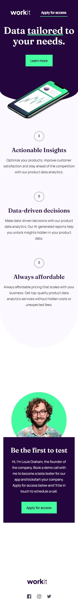
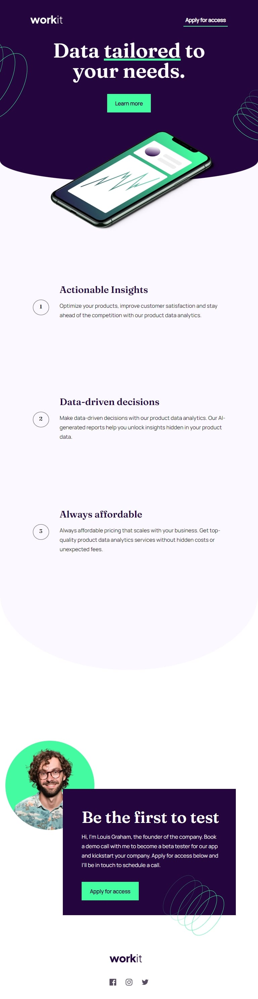
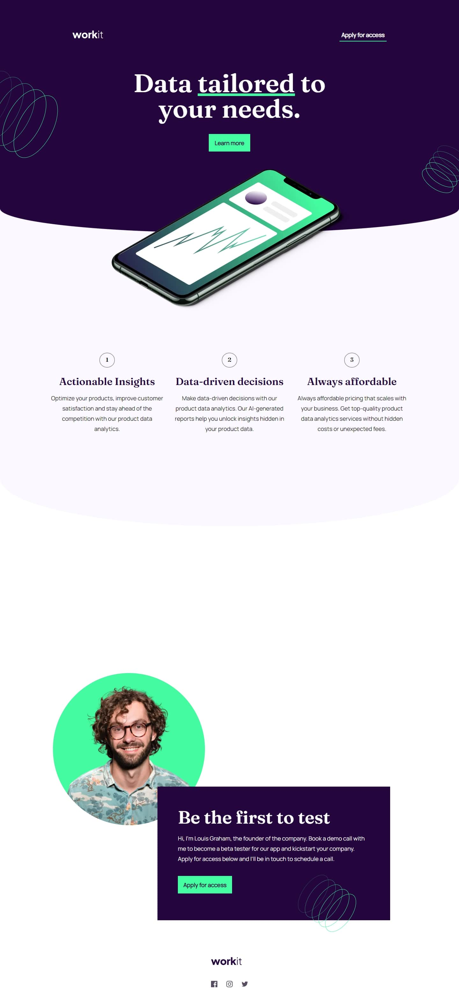

# Frontend Mentor - Workit landing page solution

This is a solution to the [Workit landing page challenge on Frontend Mentor](https://www.frontendmentor.io/challenges/workit-landing-page-2fYnyle5lu). Frontend Mentor challenges help you improve your coding skills by building realistic projects. 

## Table of contents

- [Overview](#overview)
  - [The challenge](#the-challenge)
  - [Screenshot](#screenshot)
  - [Links](#links)
- [My process](#my-process)
  - [Built with](#built-with)
  - [What I learned](#what-i-learned)
  - [Continued development](#continued-development)
  - [Useful resources](#useful-resources)
- [Author](#author)
- [Acknowledgments](#acknowledgments)

## Overview

### The challenge

Users should be able to:

- View the optimal layout for the interface depending on their device's screen size
- See hover and focus states for all interactive elements on the page

### Screenshot

### Links

- Solution URL: [Workit Landing Page Solution](https://github.com/dors001/WorkitLandingPageChallenge)
- Live Site URL: [Workit Landing Page Site](https://workit-landing-page-challenge.vercel.app/)

## My process

### Built with

- Semantic HTML5 markup
- CSS custom properties
- Flexbox
- CSS Grid
- Mobile-first workflow

### What I learned

This project tought me great basics for CSS and HTML, especially in how to manage my development work and understanding the styling tools at my disposal.

Using components make the development process much easier, as a novice front-end dev it change my perspective completly and made developing a much more of a high quality, enjoyable process.

I made sure to use only the basics of HTML and CSS with incorporating only a couple of sections that use grid and flexbox, i took the project in the goal in mind of creating a strong foundation of the basics of the HTML and CSS languges.

This project was extreamly enjoyable and educating!
This project is a fantastic way to start your journey into Fron-End development.

### Continued development

From this point i will solidify my basics in JavaScript while continue to sharpen my HTML and CSS skills so in the future i could go into React with more confidence.
*
### Useful resources

- [Code With Mosh Hamedani](https://codewithmosh.teachable.com) - I learned HTML and CSS basics from Mosh Hamedani. He has a wonderful way in delivering the subjects that make it accessible to anyone that's starting out. 

## Author

- Frontend Mentor - [@dors001](https://www.frontendmentor.io/profile/dors001)
- Email - [ds.design.dev@gmail.com](mailto:ds.design.dev@gmail.com)

## Acknowledgments

Again i need to give my thanks to Mosh Hamedani's teachings that keeps educating developers around the world.
